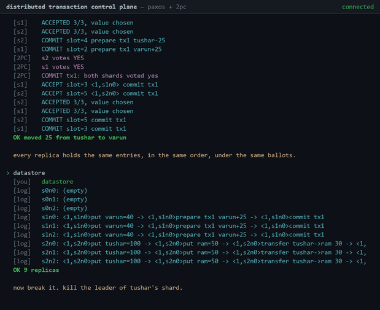
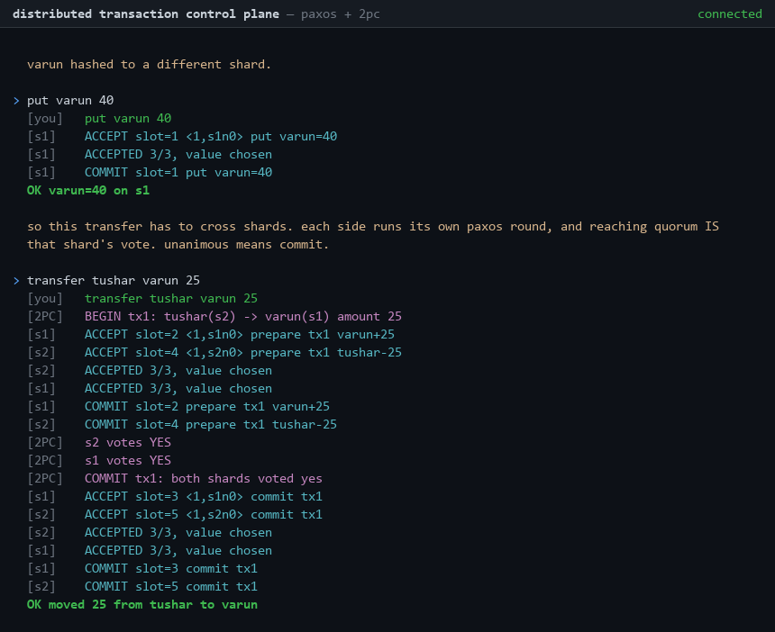
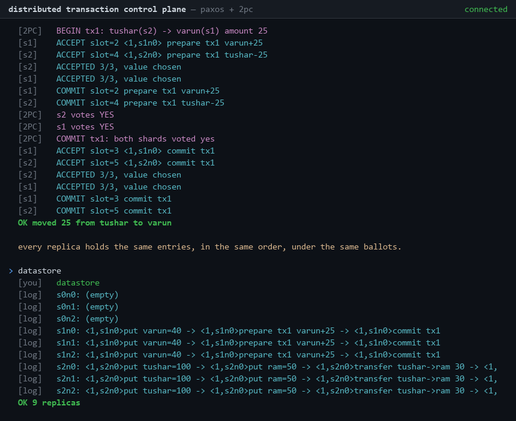
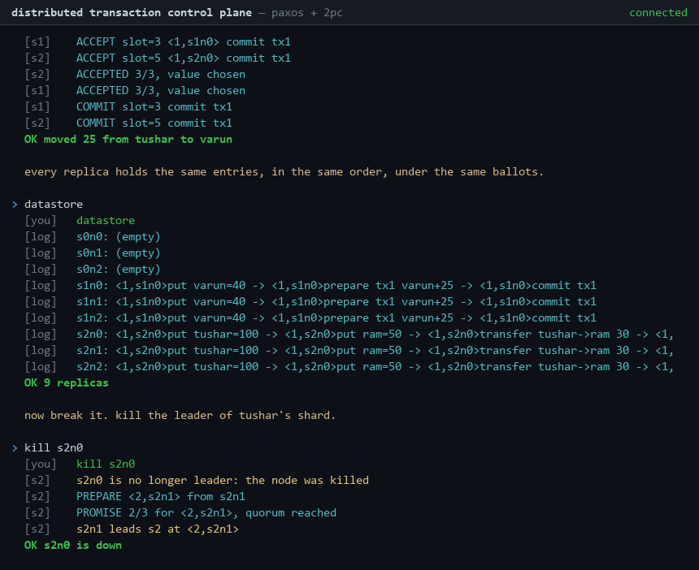
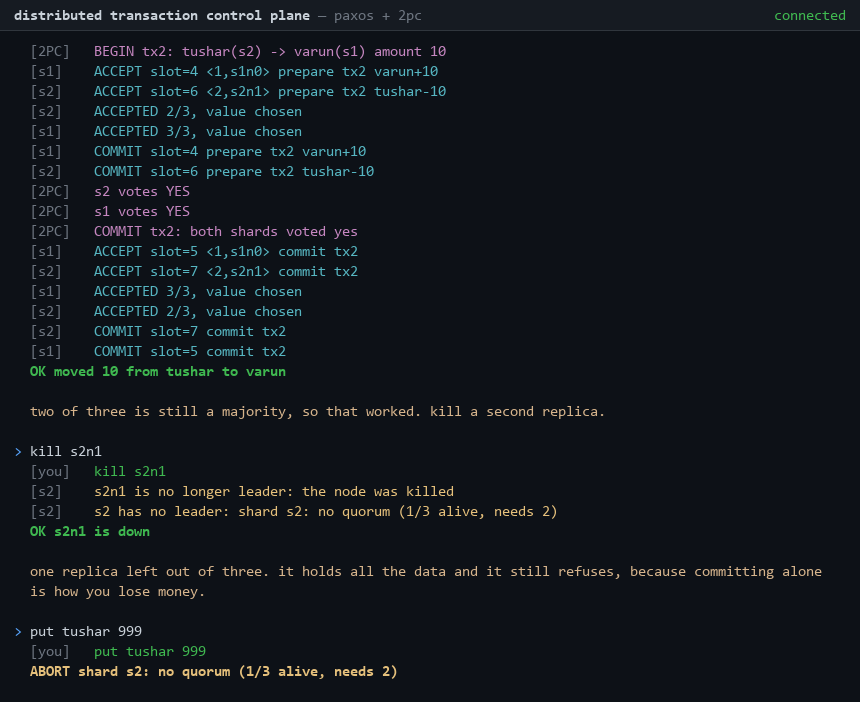
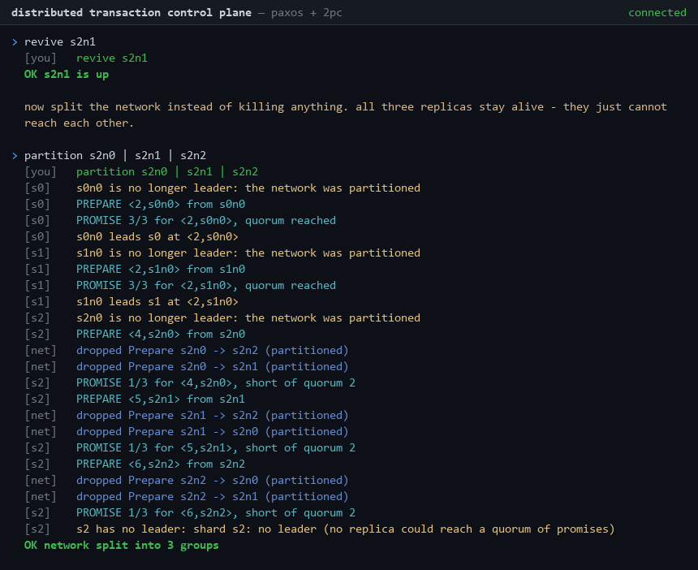
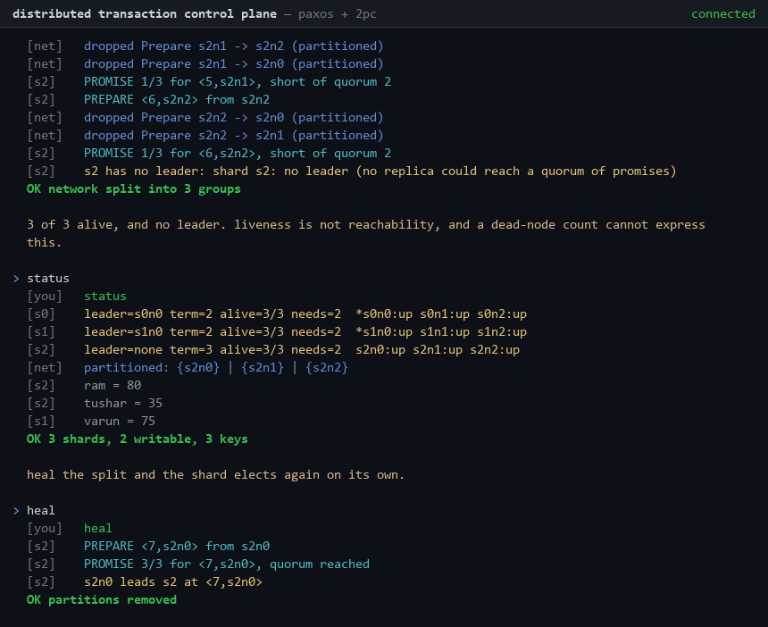

# Distributed Banking System — Paxos + Two-Phase Commit

A sharded, replicated ledger in Go, driven from a browser terminal. **Multi-Paxos**
keeps each shard's replicas agreed on one ordered log, and **two-phase commit**
makes a transfer spanning two shards atomic across both. Kill a node, split the
network, and watch consensus refuse to lie about it.

It began as a graduate distributed-systems lab. That lab is still here, in
`distributed-banking/`, along with [what changed and why](#what-changed-and-why)
— each safety bug it shipped with, paired with the test that fails without the
fix. The control plane is a rewrite built on those lessons.



<sub>Killing a shard leader, watching the cluster elect a new one, then killing a
second replica and watching the survivor refuse to commit alone. Recorded from a
real session &mdash; see [how these are generated](docs/screenshots/).</sub>

---

## Two things live here

**`cmd/`, `internal/`, `frontend/`** — the control plane. A single Go binary
running a sharded transaction cluster behind a WebSocket gateway, plus a
one-file browser terminal that drives it. See [Control plane](#control-plane)
below.

**`distributed-banking/`** — v1, the original graduate lab and the safety fixes
made to it. Its own Go module, unchanged and still green. Everything from
[How it works](#how-it-works) down describes v1.

---

## Control plane

A sharded transaction cluster driven from a browser terminal. Multi-Paxos
replicates each shard; two-phase commit makes a transfer across two shards
atomic. Kill nodes, split the network, watch consensus refuse to lie.

```bash
go run ./cmd/cluster
```

```bash
cd frontend && python3 -m http.server 8081
```

Open <http://localhost:8081> and it connects to `ws://localhost:8080/ws` on its
own. Type `demo` (or hit **run tour**) and it walks itself through the whole
story &mdash; a commit, a cross-shard transfer, a killed leader, a lost quorum, a
network split, and the recovery &mdash; narrating what to watch for. Or drive it
yourself:

```
put tushar 100
put ram 50
transfer tushar ram 30       # 2PC if they hashed to different shards
kill s0n0                   # the shard re-elects, live
partition s0n0 s0n1 | s0n2  # now no group holds a majority
status                      # leader=none, and writes abort
heal
```

### How it works

**Topology.** `-shards` by `-nodes` replicas, named `s{shard}n{index}`. Keys are
assigned to shards by FNV-1a hash. Quorum is `n/2 + 1` — a strict majority, not
`(n+1)/2`, which at n=4 would let two disjoint halves each think they had one.

**Multi-Paxos per shard.** A leader wins the shard once with a prepare round,
then every write is a single accept at the next log slot. Ballots are
`<number, node>`, so two nodes reaching the same round number are still strictly
ordered. An acceptor promises only upward, rejects accepts below its promise,
and hands back what it has accepted so a new leader re-proposes in-flight values
instead of overwriting them. Replicas apply strictly in slot order; one that
fell behind gets backfilled by the leader rather than applying across a gap.

**Election is the prepare phase.** There is no separate election protocol and no
heartbeat timer. A command that finds no leader runs one; a command whose accept
round misses quorum concludes it has lost the shard and re-elects. `kill`,
`partition` and `heal` do not pick a leader — they invalidate what was known and
let a real round find out. A leader stranded on the minority side of a split
cannot reach a quorum, so it simply cannot win.

**Two-phase commit across shards.** Each side runs its own Paxos round to record
a prepared state, and that round reaching quorum is that shard's yes vote.
Unanimity commits; anything else aborts. An abort reverses exactly what the
prepare applied and releases its locks.

**Failure lives in the transport.** `Transport` is an interface, and kill and
partition are a filter sitting in front of it. Consensus never learns a node was
"killed" — it sees a call that does not come back, which is all a real replica
ever sees. That is what makes the same fault injection work for an in-process
transport and a networked one, and what lets the whole cluster deploy as a
single container.

### What it looks like

These are of the **control plane**, generated from a recorded session; see
[`docs/screenshots/`](docs/screenshots/) for the pipeline. The v1 lab is driven
by an interactive stdin menu that the recorder cannot drive, and was never
captured.

| | |
|---|---|
| **Cross-shard transfer** &mdash; two Paxos rounds under 2PC, both shards voting | [](docs/screenshots/cross-shard-2pc.png) |
| **Converged logs** &mdash; every replica holding the same entries in the same order | [](docs/screenshots/datastore-converged.png) |
| **Leader killed** &mdash; re-elected at a higher ballot, no separate election protocol | [](docs/screenshots/leader-reelection.png) |
| **Quorum lost** &mdash; one replica of three, holding all the data, refusing anyway | [](docs/screenshots/no-quorum-refuses.png) |
| **Partitioned** &mdash; three replicas alive, no majority group, no leader | [](docs/screenshots/partitioned-leaderless.png) |
| **Healed** &mdash; the split repaired, the shard electing on its own | [](docs/screenshots/heal-recovers.png) |

### Flags

| Flag | Default | Meaning |
|------|---------|---------|
| `-addr` | `:$PORT`, else `:8080` | Listen address |
| `-shards` | `3` | Number of shards |
| `-nodes` | `3` | Replicas per shard |
| `-transport` | `inproc` | `inproc` or `grpc`. grpc is not implemented and errors rather than silently falling back |
| `-pace` | `120ms` | Delay between log frames. Presentation only; `0` disables |
| `-max-sessions` | `32` | Concurrent connections |

### Two things that are deliberate

**One cluster per connection.** Built when the socket opens, destroyed when it
closes. A visitor who leaves the network in pieces cannot hand that to the next
one. State is in memory and nothing persists.

**Pacing is presentation, not simulation.** The `-pace` delay lives in the
gateway's write loop, at the edge. Nothing sleeps inside consensus — a log
stream that arrives as one instant dump is unreadable, but a Paxos round that
slept would be lying about how fast the system is.

### Deploying

The backend is one container and the frontend is one static file. Both fit on
free tiers.

**Render** — push the repo and create a web service from the included
[`render.yaml`](render.yaml), or point it at the [`Dockerfile`](Dockerfile) by
hand. TLS is terminated by the platform, so the public endpoint is
`wss://<app>.onrender.com/ws`.

**fly.io** — [`fly.toml`](fly.toml) is included: `fly launch --no-deploy`, then
`fly deploy`.

**Frontend** — `frontend/index.html` is a single file with no build step. Drop
it on Vercel, Netlify or GitHub Pages, then type the backend URL into the field
in the header; it is remembered in `localStorage`.

**The gotcha worth knowing before you hit it:** a page served over HTTPS cannot
open a `ws://` connection. Browsers block it as mixed content and the failure is
quiet. Behind Render or Fly the URL must be `wss://`. Only local development
over `http://localhost` can use `ws://`. The frontend checks for this case and
says so rather than failing silently.

**Free tiers sleep.** Render's free plan spins down after about 15 minutes of
inactivity, so the first connection after a quiet spell waits on a cold start;
the Fly config here does the same by design. That is fine for a portfolio link
and fine for nothing else. Check the current terms of either plan before relying
on them — both have changed before.

### Limits

Per connection, so that a public endpoint does not become someone's free
compute: 10 commands per second (burst 20), 256 distinct keys, 32 concurrent
sessions, 4 KiB inbound frames, 10 minute idle timeout.

### Layout

```
cmd/cluster/          the binary: flags, gateway, shutdown
internal/logstream/   structured events; depends on nothing
internal/transport/   Transport interface, in-process impl, fault injection
internal/paxos/       ballots, acceptor, state machine, election, accept rounds
internal/cluster/     the engine: shards plus the 2PC coordinator
                      (chaos_test.go is the randomised soak)
internal/gateway/     WebSocket, wire frames, command parser, session
frontend/index.html   the terminal, one file, no build step
tools/transcript/     records a scripted session off a real socket
tools/render.py       draws that recording into the GIF and stills
docs/protocol.md      the wire contract both sides are written against
```

### Chaos testing

Alongside the scenario tests, a randomised soak runs thousands of operations
against a cluster being killed and partitioned underneath them, then checks what
the design actually promises:

- money is conserved
- no two replicas are ever committed on different values at the same slot
- no key is left locked once the cluster recovers
- no balance goes negative
- a replica's state matches a fresh replay of its own committed log

```bash
go test ./internal/cluster -run TestChaos
go test -race ./internal/cluster -run TestChaos -chaos.runs=40 -chaos.ops=2000
```

Every run prints its seed, and `-chaos.seed=<n>` replays a failure exactly. A
short soak runs on every push; a long one runs weekly in CI.

It earned its place immediately. Writing it surfaced five real defects, four of
them in the consensus layer:

| Found | Why it happened |
|---|---|
| Replicas committed **different values at the same slot** | `Commit` named only a slot number. A replica that missed the accept still held a stale entry there and committed *that*, while everyone else committed the real one. The same bug existed in the catch-up path. Both now carry the value, which is safe because a chosen value never changes. |
| A transfer **reported failure after committing** | A leader that loses a quorum of replies cannot tell "not chosen" from "chosen, but I did not hear". It reported failure while the money had moved. Commands now carry an id, so the leader asks whether it already happened instead of guessing. |
| Money **destroyed** by an abort that never arrived | A shard voting no may have prepared anyway, for the same reason. Aborting only the shards that voted yes left that one debited forever. The abort now goes to every participant; for a shard that never prepared it does nothing. |
| Commands **applied twice** | A leader re-proposing at a fresh slot duplicates a command that was in fact chosen the first time. The state machine now ignores an id it has already applied. |
| Two commands issued the **same id** | `cmdID` was called inside the two parallel prepare goroutines. Duplicate suppression would then discard one as an echo of the other and lose half a transfer. Found by `-race`. |

The first is the one worth dwelling on: it is a straightforward safety violation,
it survived every hand-written test in this repo, and no amount of staring at the
code produced it. It took a thousand random operations and a partition landing in
exactly the wrong microsecond.

### What is not done

- **The 2PC coordinator survives node failure, not process death.** Its decision
  is recorded before any attempt to deliver it and retried until every shard has
  it, so a shard that was unreachable at the deciding moment is resolved once it
  comes back rather than being left prepared forever. The record lives in process
  memory, which is honest about its limit: it does not survive the coordinator
  process itself dying. Making it do so means writing the record somewhere
  outside the process, which an in-memory demo has nowhere to put.
- **A failed operation may still commit later.** A round accepted by a minority,
  correctly reported as failed because no quorum could confirm it either way, can
  be adopted and chosen by a later leader during recovery. The leader checks
  whether a command already committed before reporting failure, which removes the
  common case, but not the case where no quorum exists to ask. This is why the
  chaos test asserts a sound interval rather than "failure means it did not
  happen" — no system promises that without the caller consulting an outcome
  registry.
- **No gRPC transport yet.** The interface exists and the fault layer sits in
  front of any implementation, which is the architecturally meaningful part. A
  second implementation is what would prove the interface is not decorative.
- **Elections are triggered by commands, not by heartbeats.** A real deployment
  detects a dead leader with a heartbeat timeout. This cluster is idle between
  keystrokes, and a heartbeat loop would burn CPU and flood the log stream to
  discover, every 150ms, that nothing had changed. The election itself is a
  genuine prepare round that can and does fail.
- **The log is unbounded.** No snapshotting and no truncation. Acceptable for a
  demo whose sessions are short by construction.

---

# v1 — the original lab

Everything below this line describes `distributed-banking/`: the graduate
distributed-systems lab this repo started as, and the safety bugs fixed in it.
It is a separate Go module, still builds, and still passes its own suite. The
control plane above is a rewrite, not a refactor of it — what carried over was
the invariants and the tests, not the code.

## Contents

- [How it works](#how-it-works)
- [Quickstart](#quickstart)
- [Running the tests](#running-the-tests)
- [Failure demos](#failure-demos)
- [What changed and why](#what-changed-and-why)
- [Limitations](#limitations)
- [Project layout](#project-layout)

---

## How it works

### Topology

You pick the cluster count and replicas per cluster at startup. Accounts are split into contiguous ranges, one per cluster. The default configuration:

| Cluster | Accounts | Replicas | Quorum |
|---------|----------|----------|--------|
| C1 | 1–1000 | S1, S2, S3 | 2 of 3 |
| C2 | 1001–2000 | S4, S5, S6 | 2 of 3 |
| C3 | 2001–3000 | S7, S8, S9 | 2 of 3 |

Every account starts with a balance of 10. Server `S<n>` listens on `localhost:500<n>` and keeps its own SQLite file (`db_S<n>.db`) holding a `clients` table (balance + lock flag) and a `transactions` table (the replicated log).

Workload comes from a CSV of transaction *sets*. Each set names the transfers plus two lists: which servers are active, and which server is the contact (leader) for each cluster.

### Intra-shard transfer — Paxos only

When both accounts live in the same cluster, the contact server runs one Paxos round:

1. **Ballot.** The leader picks a ballot strictly above anything it has seen: `Ballot{Number, ServerID}`, ordered by number then server.
2. **Prepare.** Broadcast to all replicas in parallel. An acceptor promises only if the ballot is strictly greater than its current promise, and its reply carries whatever it has already accepted.
3. **Count.** The leader proceeds only on a strict majority of promises. It adopts the value accepted under the highest ballot in that quorum — its own log is not automatically the winner.
4. **Local check.** Sender unlocked and solvent → lock both accounts.
5. **Accept.** Broadcast the proposal stamped with the ballot. Acceptors reject anything below their promise.
6. **Count again.** Only a majority of accepts makes the value *chosen*. Short of that, the leader releases its locks and gives up.
7. **Commit.** Apply locally, then broadcast so the rest of the cluster applies it too.

### Cross-shard transfer — Paxos under 2PC

When the accounts live in different clusters, each side runs its own Paxos round in parallel:

- **Source cluster** — reach quorum, verify funds, lock the sender, debit it, write the entry with status `P` (prepared), and **keep the lock held**.
- **Destination cluster** — reach quorum, lock the receiver, credit it, write status `P`, **lock held**.

Each side reaching quorum is that shard's **yes vote**. A shard that loses quorum, finds the account locked, or finds insufficient funds votes no.

The coordinator then applies the 2PC rule — unanimity or abort — and broadcasts the decision to every replica in both clusters:

- **`2PCcommit`** → flip the entry to `C`, release locks. The money has moved.
- **`2PCabort`** → reverse the balance change, release locks.

---

## Quickstart

Requires Go 1.25+. No C toolchain: the SQLite driver is pure Go, so everything builds with `CGO_ENABLED=0`.

```bash
cd distributed-banking && go run .
```

You will be prompted for the number of clusters and servers per cluster (3 and 3 reproduces the table above). The system then walks through the CSV one set at a time, pausing at a menu after each:

```
1 - Proceed to next set
2 - Print balance
3 - Print Datastore
4 - Print Performance
5 - Crash a server
6 - Restore a server
7 - Print cluster status
```

**Print Datastore** is the one to look at: it prints each replica's log as a chain of `<ballot,server>,(source,destination,amount)` entries, so you can see directly whether the replicas converged.

---

## Running the tests

```bash
cd distributed-banking && go test -race ./... -count=1
```

The suite spins up a real cluster in-process — real listeners, real RPCs — and asserts the guarantees that actually matter:

| Test | What it pins down |
|------|-------------------|
| `TestCommitWithFullClusterReplicatesToAll` | A healthy cluster commits and all replicas match |
| `TestCommitProceedsWithMinorityDown` | One replica down out of three still makes progress |
| `TestRefusesToCommitWithoutQuorum` | Two down out of three → the survivor refuses rather than committing alone |
| `TestFailedRoundReleasesLocks` | A failed round leaves no account stuck locked |
| `TestNoMoneyCreatedOrDestroyed` | Balances sum to the same total after a run of transfers |
| `TestReplicasConvergeOnIdenticalLogs` | Every replica holds the same entries in the same order, under the same ballots |
| `TestRecoveredReplicaCatchesUp` | A restarted replica catches up instead of staying behind |
| `TestReconciliationNeverDropsCommittedEntries` | Syncing from a peer never deletes committed state |
| `TestBallotOrdering`, `TestSameRoundDifferentServersAreOrdered` | Ballots form a strict total order even when two servers reach the same round |
| `TestQuorumSizeIsStrictMajority` | No two disjoint quorums are possible at any cluster size |
| `TestAssignShardsToClustersCoversEveryAccount` | Every account maps to a cluster that exists, for any cluster count |
| `TestMigrateAddsBallotServerToLegacySchema` | Databases from the old schema upgrade in place without losing rows |

---

## Failure demos

Menu option **5** crashes a replica by closing its listener — peers get a connection refused exactly as they would from a dead machine, while its database survives on disk. Option **6** brings it back; it returns with the log it died with and catches up on the next prepare round. Option **7** prints which replicas are up and whether each cluster still holds a quorum.

The sequence worth demonstrating:

1. Run a set with all replicas up → commits, all logs match.
2. Crash one replica in a cluster (2 of 3 alive) → still commits, quorum holds.
3. Crash a second (1 of 3 alive) → the leader **refuses**; balances unchanged.
4. Restore both, run another transfer → the recovered replicas catch up.

---

## What changed and why

The original passed the course's test cases but violated Paxos safety in several places. Each fix below has a test that fails without it.

### Ballots had no total order

Ballots were a bare `int`. Two servers in a cluster can independently reach the same counter value, and an acceptor comparing only counters cannot tell those proposals apart — so it followed both.

Ballots are now `Ballot{Number, ServerID}`, ordered by number then proposing server. Two leaders at round 1 produce `<1,1>` and `<1,2>`, which are strictly ordered, so acceptors can always tell which proposal is newer.

### Acceptors never rejected anything

`Prepare` did `s.BallotNumber = request.LeaderBallotNumber` unconditionally — it adopted whatever ballot arrived, letting a stale leader reclaim a cluster that had already promised to a newer one.

Acceptors now promise only to a strictly greater ballot, reject accepts below their promise, and return what they have already accepted so the leader can adopt an in-flight value rather than overwrite it.

### The leader never counted votes

`PreparePhase` and `AcceptPhase` looped over peers, fired an RPC, and **discarded both the reply and the error**. Nothing was ever tallied, so the leader committed regardless of what the cluster said. This is the bug that meant the code did not actually implement Paxos.

Both phases now broadcast concurrently, collect replies, and return a count. The leader commits only on a strict majority at *both* phases, and releases its locks when a round fails. Every RPC has a timeout, so a dead peer fails fast instead of hanging the round.

### The quorum check consulted the test fixture

The old gate was `len(request.ActiveServers) < GetQuorumSize()` — how many servers the **CSV file claimed** were up, not how many replied. A partitioned leader whose CSV still listed nine servers would commit alone.

That check is gone. The gate is now the promise and accept counts returned by the phases themselves.

### Quorum size was not a majority

`GetQuorumSize` returned `(n+1)/2`, which is a majority only for odd `n`. With four servers it returned 2, so two disjoint halves could each believe they held a quorum. Now `n/2 + 1`.

### Reconciliation destroyed committed state

`FetchLongestTransactionHistory` picked whichever replica reported the most rows, then `DELETE`d every local row and rewrote the table from that peer. Length is not authority, and destroying durable history to synchronise means one bad peer can erase a replica's log.

Reconciliation is now additive: entries already present are left alone, missing entries are inserted, and nothing is ever deleted.

### A data race decided what got sent

Both cross-shard goroutines wrote `ContactServer` on the same shared transaction struct before passing it by value into their RPC, so whichever wrote last silently decided what the other side sent. Each side now gets its own copy. The suite runs clean under `-race`.

### Accounts could be locked forever

A round that took locks and then failed left both accounts locked with no path to release, so every later transfer touching them aborted. Failed rounds now release what they took.

### Shard assignment could map past the end

`AssignShardsToClusters` used a flat `dataCount/clusterCount` stride, so any count that did not divide evenly pushed trailing accounts into a cluster index past the end — 3000 accounts over 7 clusters put the last 6 in `C8`, which does not exist. The remainder is now spread over the leading clusters.

### Housekeeping

- Swapped `mattn/go-sqlite3` (cgo) for `modernc.org/sqlite` (pure Go), so the project builds with no C toolchain.
- `GetAllTransactions` returned `[]map[string]interface{}` and callers did unchecked `.(int)` assertions that would panic on any surprise. It returns `[]shared.Transaction` now, deleting those sites entirely.
- Connections were `defer client.Close()`d **inside loops**, leaking until the whole phase returned. They close per iteration.
- Removed ~145 lines of commented-out debug printing and three unused files.
- Replaced the CI workflow — which POSTed the repo and commit SHA to a course grading endpoint — with build, vet, gofmt, and `go test -race`.

---

## Limitations

Stated plainly, because they are real:

- **The replicas are goroutines in one process.** They communicate over genuine TCP RPC with real listeners, and crashing one produces a real connection refused — but they are not separate OS processes. Running them as separate processes would need a config file and a `cmd/server` split.
- **The 2PC coordinator is not crash-recoverable.** It holds its decision in memory with no write-ahead log. If it dies between the votes and the decision broadcast, participants are left holding locks with no one to resolve them. A durable decision log plus a recovery pass on restart is the fix.
- **No leader election.** The contact server for each cluster comes from the CSV rather than being elected. Paxos will correctly reject a stale leader, but nothing promotes a new one automatically.
- **Locks are held across network calls.** `HandleTransaction` holds the server mutex for its whole body, including synchronous RPCs to peers that take their own locks. The 10 ms gap between transactions is currently what keeps this from deadlocking.
- **The log has no explicit index.** Entries are ordered by insertion time rather than by a monotonic position, which is enough here but would not survive concurrent leaders writing at the same index.

---

## Project layout

```
distributed-banking/
├── main.go              Workload driver, 2PC coordinator, operator menu
├── main_test.go         Shard assignment tests
├── client/              RPC client helpers
├── csv_parser/          Test-case CSV reader
├── database/            SQLite schema, migrations, queries
├── paxos/               Prepare / Accept / Commit phases, quorum counting
├── server/              Replica: acceptor logic, leader logic, lifecycle
│   └── cluster_test.go  In-process cluster integration tests
└── shared/              Ballot, Transaction, addressing, quorum math
```
